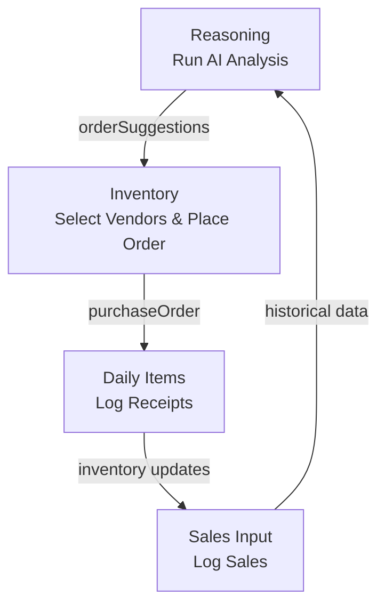

# InventraAI – AI-Powered Inventory Management

InventraAI is a full-stack inventory management system that uses AI to analyze datasets, generate stock/expiry/order recommendations, and streamline vendor ordering and daily operations. It includes a React frontend with Zustand state persistence and a Flask backend with modular API blueprints.

## 🚀 Quick Start

### Prerequisites
- Node.js 18+
- Python 3.11+
- PostgreSQL (optional; defaults to SQLite)

### Install & Run
```bash
# Frontend
cd frontend
npm install
npm start

# Backend
cd backend
python -m venv venv
source venv/bin/activate  # Windows: venv\Scripts\activate
pip install -r requirements.txt
flask run
```

Open http://localhost:3000. The app will guide you through:
1) Upload a dataset (Datasets page)
2) Train a model (ML Pipeline page)
3) Run AI analysis (Reasoning page)
4) Create orders (Inventory page)
5) Log receipts (Daily Items page)
6) Record sales (Sales Input page)

## 📁 Project Structure

```
build_and_grow2.0/
├─ frontend/
│  ├─ src/
│  │  ├─ pages/          # Feature pages: Reasoning, Inventory, DailyItems, SalesInput, MLPipeline, Dashboard
│  │  ├─ store/          # Zustand stores: authStore, inventoryStore
│  │  ├─ constants/      # Shared constants (e.g., VENDORS_LIST)
│  │  └─ services/       # API client modules
├─ backend/
│  ├─ api/               # Flask blueprints: reasoning_bp, inventory_bp, daily_items_bp, sales_bp, models_bp, datasets_bp
│  ├─ models/            # SQLAlchemy models
│  └─ services/          # Business logic and ML pipeline
└─ README.md
```

## 🧠 Core Features

| Feature | Route | What It Does |
|---------|-------|--------------|
| AI Reasoning | `/reasoning` | Runs stock/expiry/order/trends analysis on a selected dataset and model; writes results to `inventoryStore` via `setAllAnalysis()` [1](#1-0)  |
| Inventory Management | `/inventory` | Reads AI order suggestions, lets users select vendors, send quotation requests, and place purchase orders [2](#1-1)  |
| Daily Items (Perishables) | `/daily-items` | Configure daily items, log receipts, compare expected vs received quantities |
| Sales Input & Tracking | `/sales-input` | Manual entry, CSV upload, daily summaries, product analytics [3](#1-2)  |
| ML Pipeline | `/ml-pipeline` | Dataset upload, preprocessing, AutoML training, model monitoring |
| Dashboard | `/dashboard` | System overview with quick metrics and navigation shortcuts |

## 🔄 Typical Workflow



1) **Upload data** (Datasets) → 2) **Train model** (ML Pipeline) → 3) **Run AI analysis** (Reasoning) → 4) **Create orders** (Inventory) → 5) **Log receipts** (Daily Items) → 6) **Record sales** (Sales Input) → repeat.

## 🗄️ State Management

- Central Zustand store `inventoryStore` persists to `localStorage` under key `inferx-inventory` [4](#1-3) .
- Shared analysis state (`orderSuggestions`, `stockAnalysis`, `expiryAnalysis`, `trendsAnalysis`, `fullReport`) is written by Reasoning and read by other pages.
- Page-specific state (`reasoningState`, `inventoryState`, `salesState`) is isolated per feature.

## 🛠️ Tech Stack

- **Frontend**: React 18, React Router, Zustand, Axios
- **Backend**: Flask, Flask-SQLAlchemy, Flask-JWT-Extended, Blueprints
- **Database**: PostgreSQL (production) / SQLite (dev)
- **ML/AI**: Scikit-learn, Pandas, AutoML helpers (backend)

## 📚 Key Pages & APIs

| Page | API Blueprint(s) | Key Endpoints |
|------|------------------|---------------|
| Reasoning | `reasoning_bp`, `models_bp`, `datasets_bp` | `POST /api/reasoning/{stock-analysis,expiry-analysis,order-suggestions,trends,full-report}/:id` |
| Inventory | `inventory_bp` | `GET /api/inventory/suggest-order`, `POST /api/inventory/orders` |
| Daily Items | `daily_items_bp` | `GET /api/daily-items/items`, `POST /api/daily-items/log-receipt` |
| Sales Input | `sales_bp`, `datasets_bp` | `POST /api/sales/log`, `POST /api/sales/upload-csv` |

## 🧩 Shared Data

- `VENDORS_LIST` constant is imported by both Inventory and Daily Items for consistent vendor data [5](#1-4) .
- Demo data fallbacks are defined in each page for development/error handling.

## 🤝 Contributing

1) Fork the repo.
2) Create a feature branch (`git checkout -b feature/amazing-feature`).
3) Commit changes (`git commit -m 'Add amazing feature'`).
4) Push to the branch (`git push origin feature/amazing-feature`).
5) Open a Pull Request.

## 📄 License

MIT License — see LICENSE file for details.

## Notes
- The README synthesizes information from the Core Features and Inventory Management wiki pages and key source files. For deeper details, refer to the inline documentation in each component and blueprint.
- If you are setting up the project for the first time, ensure the backend Flask app is running before starting the React frontend to avoid CORS or API errors.

Wiki pages you might want to explore:
- [Core Features (Vinayak0987/build_and_grow2.0)](/wiki/Vinayak0987/build_and_grow2.0#2.4)
- [Inventory Management (Vinayak0987/build_and_grow2.0)](/wiki/Vinayak0987/build_and_grow2.0#2.4.2)

Wiki pages you might want to explore:
- [Core Features (Vinayak0987/build_and_grow2.0)](/wiki/Vinayak0987/build_and_grow2.0#2.4)
- [AI Reasoning Engine (Vinayak0987/build_and_grow2.0)](/wiki/Vinayak0987/build_and_grow2.0#2.4.1)

### Citations

**File:** frontend/src/pages/Reasoning.jsx (L5-16)
```javascript
export default function Reasoning() {
    const { token } = useAuthStore()
    const {
        reasoningState,
        setReasoningState,
        setAllAnalysis,
        stockAnalysis,
        expiryAnalysis,
        orderSuggestions,
        trendsAnalysis,
        fullReport
    } = useInventoryStore()
```

**File:** frontend/src/pages/Inventory.jsx (L222-309)
```javascript
    const hasActionItems = orderSuggestions?.suggested_items?.length > 0
    const selectedVendorsList = vendors.filter(v => selectedVendors.includes(v.id))

    return (
        <div className="inventory-page">
            <div className="inventory-header">
                <div>
                    <h1>🤖 AI Inventory Center</h1>
                    <p>Order Generation Agent - Smart inventory replenishment</p>
                    {lastUpdated && (
                        <span className="last-updated">
                            Last analyzed: {new Date(lastUpdated).toLocaleString()}
                        </span>
                    )}
                </div>
                <button
                    className={`refresh-btn ${refreshing ? 'spinning' : ''}`}
                    onClick={handleRefresh}
                    disabled={refreshing}
                >
                    <svg width="20" height="20" viewBox="0 0 24 24" fill="none" stroke="currentColor" strokeWidth="2">
                        <path d="M23 4v6h-6M1 20v-6h6M3.51 9a9 9 0 0 1 14.85-3.36L23 10M1 14l4.64 4.36A9 9 0 0 0 20.49 15" />
                    </svg>
                    {refreshing ? 'Refreshing...' : 'Refresh'}
                </button>
            </div>

            {/* Purchase Tracking Section - Shows when quotations are sent */}
            {purchaseOrder && trackingStep && (
                <div className="purchase-tracking-section">
                    <div className="tracking-header">
                        <div className="tracking-title">
                            <span className="tracking-icon">📋</span>
                            <div>
                                <h2>Purchase Order Tracking</h2>
                                <p>Order ID: {purchaseOrder.orderId}</p>
                            </div>
                        </div>
                        <div className="tracking-vendor-count">
                            <span className="vendor-label">Vendors Contacted:</span>
                            <span className="vendor-count">{purchaseOrder.quotationVendors?.length || 0}</span>
                        </div>
                    </div>

                    <div className="tracking-progress">
                        {/* Step 1: Quotation Sent */}
                        <div className={`tracking-step ${getTrackingStepIndex() >= 0 ? 'active' : ''} ${trackingStep === TRACKING_STEPS.QUOTATION_SENT ? 'current' : ''}`}>
                            <div className="step-icon">📧</div>
                            <div className="step-content">
                                <span className="step-label">Quotation Request Sent</span>
                                <span className="step-time">
                                    {new Date(purchaseOrder.quotationSentAt).toLocaleString()}
                                </span>
                                <span className="step-detail">
                                    Sent to {purchaseOrder.quotationVendors?.length} vendors
                                </span>
                            </div>
                            <div className={`step-connector ${getTrackingStepIndex() >= 1 ? 'active' : ''}`}></div>
                        </div>

                        {/* Step 2: Select Vendor */}
                        <div className={`tracking-step ${getTrackingStepIndex() >= 1 ? 'active' : ''} ${trackingStep === TRACKING_STEPS.SELECT_VENDOR ? 'current' : ''}`}>
                            <div className="step-icon">🔍</div>
                            <div className="step-content">
                                <span className="step-label">Select Vendor</span>
                                {trackingStep === TRACKING_STEPS.SELECT_VENDOR && (
                                    <div className="vendor-dropdown-container">
                                        <select
                                            className="vendor-dropdown"
                                            value={finalVendor?.id || ''}
                                            onChange={(e) => handleFinalVendorSelect(e.target.value)}
                                        >
                                            <option value="">-- Select Best Vendor --</option>
                                            {purchaseOrder.quotationVendors?.map(vendor => (
                                                <option key={vendor.id} value={vendor.id}>
                                                    {vendor.name} ({vendor.category})
                                                </option>
                                            ))}
                                        </select>
                                        <p className="dropdown-hint">Choose the vendor with the best quotation</p>
                                    </div>
                                )}
                            </div>
                            <div className={`step-connector ${getTrackingStepIndex() >= 2 ? 'active' : ''}`}></div>
                        </div>

                        {/* Step 3: Vendor Selected */}
                        <div className={`tracking-step ${getTrackingStepIndex() >= 2 ? 'active' : ''} ${trackingStep === TRACKING_STEPS.VENDOR_SELECTED ? 'current' : ''}`}>
```

**File:** frontend/src/pages/SalesInput.jsx (L226-259)
```javascript
    // Upload CSV (keep as fallback)
    const handleUploadCSV = async (e) => {
        const file = e.target.files?.[0]
        if (!file) return

        const uploadData = new FormData()
        uploadData.append('file', file)

        try {
            const result = await salesApi.uploadCsv(uploadData)
            const data = result.data
            showToast(`Successfully imported ${data.imported} sales records!`)

            if (data.date_range?.max) {
                const maxDate = data.date_range.max
                setSelectedDate(maxDate)
                await loadDailySales(maxDate)
                showToast(`Showing data for ${maxDate}`)
            } else {
                await loadDailySales()
            }

            await loadHistory()
        } catch (err) {
            console.error('Upload failed:', err)
            showToast('Upload failed: ' + (err.response?.data?.error || err.message), 'error')
        }

        // Reset file input
        if (fileInputRef.current) {
            fileInputRef.current.value = ''
        }
    }

```

**File:** frontend/src/store/inventoryStore.js (L108-122)
```javascript
        {
            name: 'inferx-inventory',
            partialize: (state) => ({
                orderSuggestions: state.orderSuggestions,
                stockAnalysis: state.stockAnalysis,
                expiryAnalysis: state.expiryAnalysis,
                trendsAnalysis: state.trendsAnalysis,
                fullReport: state.fullReport,
                lastUpdated: state.lastUpdated,
                reasoningState: state.reasoningState,
                inventoryState: state.inventoryState,
                salesState: state.salesState
            })
        }
    )
```
